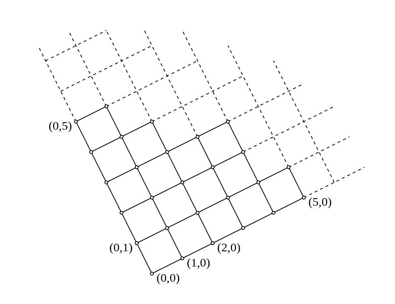
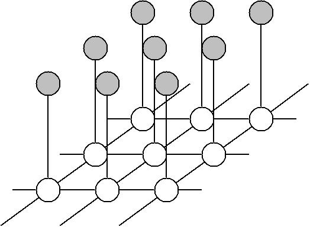

# $$ f = id $$

---

---

# (Speculative) Motivation

- "Early Vision"
- computer vision papers keep mentioning *random fields*
- especially they somehow end up in neural nets
- words from AI BS bingo seem to have rigorously and probabilistically treated cousins

---

(Mis-)Interpretation by Vlad Ki

---

---

# Statistical Physics

---

---

# Outline

---

- **Bayesian**
_(an inference framework)_
- **MRFs & Images**
_(modeling image restoration images)_
- **Gibbs Sampler**
_(a computationally tractable representation for MRFs defined over graphs)_
- **Relaxation**
_(computing the best Gibbs)_

---

---

# (Statistics) Framework Wars

Frequentist to Bayesian is like Angular to React

---

# Bayes

- originally published to make theological arguments
- made cool by Laplace
- inference and decision come as plugins
- works recursively (Kalman, Particle filters & more, aka sequential estimation)
- AI without a GPU: just refine your priors

---

- y - signal (measurement, evidence, input)
- **x - state** (unknown, hypothesis, output)

think: model parameters vs data

---

$$ P({\bf x}|y) = \frac{P(y|{\bf x}) P({\bf x})}{P(y)} $$

## posterior = likelihood times prior, over evidence

Bayes rule lets us swap those!

---

# Estimation problems

- **MAP** - maximum a posteriori
- **MLE** - maximum likelihood (aka MAP when you have no prior)

^ ---
^
^ $$ P(y) = \int_i P(y | \mathbf{x}_i) P(\mathbf{x}_i) $$
^
^ ## normalizing constant

---

$$ −\log\,P({\bf x}|y) = −\log\,P(y|{\bf x}) − \log\,P({\bf x}) + C$$

**log**s are like probability buffs: slay **exp**s,
turn ugly $$\prod$$ into neat $$\sum$$

negation turns maximization into minimization

---

## Aside

$$ E({\bf x},y) = E_d({\bf x},y) + E_p({\bf x}) $$

# energy $$\sim$$ log likelihood

(stat physics and CV people like saying *energy* a lot)

---

# Graphs

---

$$\newcommand\neib{\mathscr{G}}$$
$$ S = \{s_1, s_2, \dotsb, s_N \} $$
sites (nodes)

$$ \neib = \{ \neib{}_s, s \in S \} $$
neighborhood family (edges per site)

$$ \neib{}_s = \{ t \mid t \in S, t \in \neib{}_s \leftrightarrow s \in \neib{}_r \} $$
neighborhood set, symmetric (undirected)

---

$$ C \subset S $$
cliques are subsets of sites

$$ C = \{ s, t, \dotsb \in S \mid \forall (s \in C,t \in C): s \in \neib{}_t \wedge t \in \neib{}_s \} $$
such that every pair in the set is a neighbor

$$\mathcal{C}$$ means "all cliques": $$ C \in \mathcal{C} $$

---

# Graphs and Images

---

$$m\times m$$ **lattice**: $$Z_m = \{(i,j): 1 \leq i, j \leq m\}$$

---

$$S_{m\times m} = Z_m$$

Pixels: $$ \{ F(i,j) = f : \Lambda \} $$

$$\Lambda \in \{i \mid 0 < i < L\}$$ (grayscale)

$$L = 255$$ - 8-bit grayscale

$$ \mathcal{F} = \{ \mathcal{F}_{i,j} \,|\, (i,j) \in Z_m, \mathcal{F}_{i,j} \subset Z_m \} $$

---

# Homogeneous neighborhoods

$$ \neib = \mathcal{F}_c = \{ \mathcal{F}_{i,j} \mid (i,j) \in Z_m \} $$

$$ \mathcal{F}_{i,j} = \{ (k, l) \in Z_m \mid 0 \le (k-i)^2 + (l-j)^2 \leq c \} $$

---

# More than pixels

$$S = D_m$$
"dual" lattice for edge elements, midway between each pixel pair

^ $$\mathcal{L} = \{ \mathcal{L}_d \mid d \in D_m \} $$

---

# Or take both

$$S = Z_m \cup D_m$$

---

---

# MRF
## Markov Random Field

---

$$ X = \{ X_s \mid s \in S \} $$

family of random variables per site

---

X is a **MRF** wrt $$\neib$$ if

$$P(X = \omega) > 0 \;\forall \omega \in \Omega$$
all probabilities are positive

$$ P(X_s = x_s \mid X_r = x_r, r \neq s) $$
probability of a site given others

$$= P(X_s = x_s | X_r = x_r, r \in \neib{}_s) $$
is the same as a probability of a site given its neighbors (Markov Property)

---

# Markov Property

- probability at site $$k$$ depends only at values of a finite neighborhood

$$ P(\sigma_k = s\mid\sigma_j,\, j\ne k) = P(\sigma_k = s\mid\sigma_j,\, j \in N_k) $$

- $$N_k$$ neighborhood of site $$k$$

---

# Bayesian Model

---

# Noisy Image Prior

# $$ G = \phi(H(F)) \odot N $$

- $$ F(i,j) : \Lambda $$: pixel intensities ($$\Lambda \in \{i\,|\, 0 \leq i \leq 255\}$$)
- $$\phi$$ - some nonlinearity (like $$ \sqrt{x} $$)
- $$H$$ - blur
- $$N$$ - invertible noise

---

# Original Image

$$X = (F, \mathcal{L})$$ is a MRF over a graph that contains original intensities ($$F$$) and image edges ($$\mathcal{L}$$).

A set of all possible configurations of $$X$$:
$$ \Omega = \{ \omega = x_{s_1}, \dotsb, x_{s_N} \} $$

---

^ top: observations, bottom: model (original image)

---

# Posterior

$$ P (X = \omega \mid G = g) \propto P(G = g \mid X = \omega) \times P(X = \omega) $$

What was the original image given the data?

---

# Maximum A Posteriori

Let's enumerate $$L^{m^2}$$ states!

---

# Hammersley-Clifford Theorem

- any probability measure that satisfies a Markov property is a Gibbs distribution for an appropriate choice of (locally defined) energy function

## MRF $$\sim$$ Gibbs

---

# [fit] Gibbs Distribution
aka Boltzmann Distribution

$$ \pi(\omega) = {1 \over Z} \; e^{-\dfrac{U(\omega)}{T}} $$

$$T$$ - temperature
$$U(\omega)$$ - **energy** function

---

$$ Z = \sum_w e^{-\dfrac{U(\omega)}{T}} $$

- normalizing **constant** ("partition function")

---

# What would U be?

$$ U(\omega) = \sum_{c \in \mathcal{C}} V_c(\omega) $$

- $$\{V_c, c\in\mathcal{C}\} $$ - set of graph clique potentials

---

# [fit] Gibbs Sampler

- introduced in the subj paper
- produces a Markov chain $$\{ X(t), t = 0,1,2 ...\}$$ with $$\pi$$ as equilibrium distribution
- MCMC algorithm family

---

$$ P(X_s(t) = x_s, s \in S) = \pi(X_{n_t} = x_{n_t} \mid X_s = x_s, s \neq n_t)\,P(X_s(t-1) = x_s, s \neq n_t) $$

## P(new state of site) = Gibbs(visited now | others) P(everyone else before)

^ 12.1

- This MAP is a statistical process itself (hence MCMC)
- Parallel!

---

# Theorem A (Relaxation)

$$ \lim_{t\to\infty} P(X(t) = \omega | X(0) =  \eta) = \pi(\omega)  $$

No matter where we start ($$\eta$$), our state $$\omega$$ will end up a Gibbs Distribution $$\pi$$ if we keep ($$\lim$$) sampling infinitely $$t\to\infty$$.

---

# Simulated Annealing

---

# Experiments

---

## Clique potentials?

### What configurations of local variables are preferred to others

---

## What are clique potentials for restoring images?

[end of section $$\mathbf{XIII}$$]

---

---

---

---

---

# Runnable Demo

- http://www.inf.u-szeged.hu/~kato/software/
- "Supervised Image Segmentation Using Markov Random Fields"
- "Supervised Color Image Segmentation in a Markovian Framework"
- Usable on https://github.com/proger/mrf

---

---

# Beyond

---

- Do more things with MRFs! (like segmentation)
- MAP using Graph Cuts (Ford-Fulkerson for max-flow/min-cut)
- CRF (learning potentials by conditioning on training data)

$$\dotsb$$

---

# Next steps

[Probabilistic Graphical Models](https://www.coursera.org/learn/probabilistic-graphical-models) by Daphne Koller

(MRF is a "undirected probabilistic graphical model")

[Pattern Recognition and Machine Learning](https://www.microsoft.com/en-us/research/people/cmbishop/) by Christopher Bishop

(More theory on everything)
